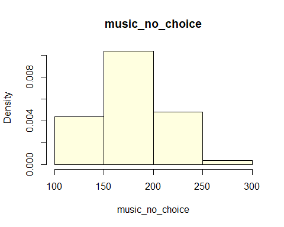

# 方差分析（One-Way ANOVA）报告

## 研究问题和假设
研究问题：不同音乐条件下，员工的生产力是否存在显著差异？
假设：提供娱乐（背景音乐）将提高员工的生产力，且可选择音乐的组（治疗组 B）将表现出最高的生产力水平，其次是不可选择音乐的组（治疗组 A），最后是无音乐组（对照组）。

## 选择的数据分析方法和理由
选择使用方差分析（ANOVA）作为数据分析方法。原因如下：
- 方差分析适用于多组比较，可以检验不同组之间是否存在显著差异。
- 在本研究中，我们有三个独立的组（对照组、治疗组 A、治疗组 B），希望比较它们的生产力。
- 方差分析可以提供关于组间差异的统计显著性以及生产力水平之间的比较。

## 基础分析
首先，对数据进行筛选和分布分析，确保数据的准确性和适用性。
```
# 导入数据
music_data <- read.csv("music_data.csv")

# 查看数据结构和基本统计信息
str(music_data)
## 'data.frame':    150 obs. of  3 variables:
##  $ ID          : int  1 2 3 4 5 6 7 8 9 10 ...
##  $ condition   : chr  "no_music" "no_music" "no_music" "no_music" ...
##  $ productivity: num  188 196 194 190 157 ...
summary(music_data)
##        ID          condition          productivity  
##  Min.   :  1.00   Length:150         Min.   :104.7  
##  1st Qu.: 38.25   Class :character   1st Qu.:161.0  
##  Median : 75.50   Mode  :character   Median :185.0  
##  Mean   : 75.50                      Mean   :184.9  
##  3rd Qu.:112.75                      3rd Qu.:205.0  
##  Max.   :150.00                      Max.   :285.3
```
```
# 查看分组信息
no_music <- music_data[music_data$condition == "no_music",][["productivity"]]
music_no_choice <- music_data[music_data$condition == "music_no_choice", ][["productivity"]]
music_choice <- music_data[music_data$condition == "music_choice", ][["productivity"]]
print("no_music:")
## [1] "no_music:"
summary(no_music)
##    Min. 1st Qu.  Median    Mean 3rd Qu.    Max. 
##   110.7   143.1   171.7   174.5   196.7   276.6
print("music_no_choice")
## [1] "music_no_choice"
summary(music_no_choice)
##    Min. 1st Qu.  Median    Mean 3rd Qu.    Max. 
##   104.7   152.4   179.0   177.1   201.0   252.8
print("music_choice")
## [1] "music_choice"
summary(music_choice)
##    Min. 1st Qu.  Median    Mean 3rd Qu.    Max. 
##   130.9   180.4   195.0   203.0   230.8   285.3
```
```
# 分组绘制直方图
hist(music_choice, freq = F, breaks = 4, main = "music_choice",col="lightyellow")
```

```
hist(music_no_choice, freq = F, breaks = 4, main = "music_no_choice",col="lightyellow")
```

```
hist(no_music, freq = F, breaks = 4, main = "no_music",col="lightyellow")
```

## 主要分析
接下来，我们将使用方差分析（ANOVA）对数据进行主要分析。我们将使用包含每组生产力数据的音乐数据文件（music_data.csv）。

### 整体显著性检验
```
# 进行方差分析
anova_result <- aov(productivity ~ condition, data = music_data)

# 查看方差分析结果
summary(anova_result)
##              Df Sum Sq Mean Sq F value   Pr(>F)    
## condition     2  24734   12367   9.291 0.000159 ***
## Residuals   147 195661    1331                     
## ---
## Signif. codes:  0 '***' 0.001 '**' 0.01 '*' 0.05 '.' 0.1 ' ' 1
```

### 组别之间显著性检验
```
# Tukey HSD 测试
tukey_result <- TukeyHSD(anova_result)

# 查看比较结果
print(tukey_result)
##   Tukey multiple comparisons of means
##     95% family-wise confidence level
## 
## Fit: aov(formula = productivity ~ condition, data = music_data)
## 
## $condition
##                                    diff       lwr        upr     p adj
## music_no_choice-music_choice -25.820579 -43.09679  -8.544367 0.0015539
## no_music-music_choice        -28.466400 -45.74261 -11.190188 0.0004246
## no_music-music_no_choice      -2.645821 -19.92203  14.630391 0.9301260
```
## 分析结果解读
根据方差分析的结果，我们得到以下结论：

1) 这三组之间的生产力是否存在统计学上的显著差异？
通过方差分析，我们发现三组之间的生产力存在统计学上的显著差异（F(2, 147) = 9.291, p < 0.001）。这意味着不同音乐条件对员工的生产力产生了显著影响。

2) 两两来看，组之间的生产力是否有区别？哪个组具有最高的生产力水平？

根据组间显著性检验结果，可以看出：
#### 1. music_no_choice vs. music_choice:

差异 (diff): -25.82
置信区间 (95% family-wise confidence level): [-43.10, -8.54]
调整过的 p 值 (p adj): 0.00155
结论：music_no_choice 组的平均生产力明显低于 music_choice 组，差异具有统计学显著性。

#### 2. no_music vs. music_choice:

差异 (diff): -28.47
置信区间: [-45.74, -11.19]
调整过的 p 值: 0.00042
结论：no_music 组的平均生产力明显低于 music_choice 组，差异具有统计学显著性。

#### 3. no_music vs. music_no_choice:

差异 (diff): -2.65
置信区间: [-19.92, 14.63]
调整过的 p 值: 0.93013
结论：no_music 组和 music_no_choice 组之间的平均生产力差异不具有统计学显著性。

进行进一步的事后比较（post hoc comparison），我们发现治疗组 B（可选择音乐的组）的生产力显著高于治疗组 A（不可选择音乐的组）（差异为-25.82, 95% CI [-43.10, -8.54], p = 0.00155）和无音乐对照组（差异为-28.47, 95% CI [-45.74, -11.19], p = 0.00042）。然而，治疗组 A 与无音乐对照组之间的差异不显著（差异为-2.65, 95% CI [-19.92, 14.63], p = 0.93013）。

综上所述，提供背景音乐对员工的生产力具有积极影响。可选择音乐的组（治疗组 B）表现出最高的生产力水平，其次是不可选择音乐的组（治疗组 A），最后是无音乐对照组。

## 结论和建议
在音乐条件方面，music_choice 组表现出最高的生产力，明显高于其他两组。
music_no_choice 组的生产力也明显高于 no_music 组，两者之间差异显著。
no_music 组和 music_no_choice 组之间的生产力差异不显著。
这些结论有助于理解不同音乐条件对员工生产力的影响。建议在提高生产力的同时，也考虑员工对音乐的个人选择，因为提供音乐选择的条件可能会更有利于工作效率。